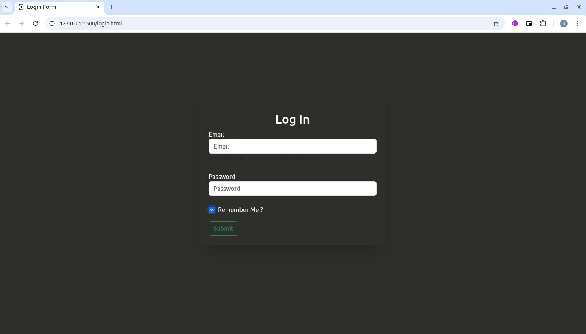

# Login Page

##  About

This project is a simple and elegant login page built with [HTML](https://developer.mozilla.org/en-US/docs/Web/HTML) and [CSS](https://developer.mozilla.org/en-US/docs/Web/CSS), perfect for learning the fundamentals of form design and styling. The page includes fields for username and password, a stylish login button, and an optional “Remember Me” checkbox. With a responsive and modern design, it adapts to various screen sizes, offering a smooth user experience across devices. This login page serves as a great starting point for understanding form layouts, CSS styling, and basic UI design

## 🛠 Built With

• [HTML](https://developer.mozilla.org/en-US/docs/Web/HTML)

• [CSS](https://developer.mozilla.org/en-US/docs/Web/CSS)